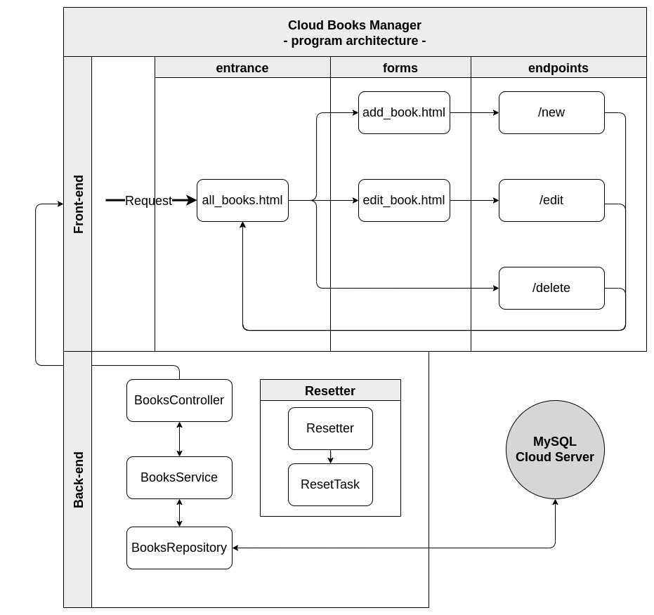
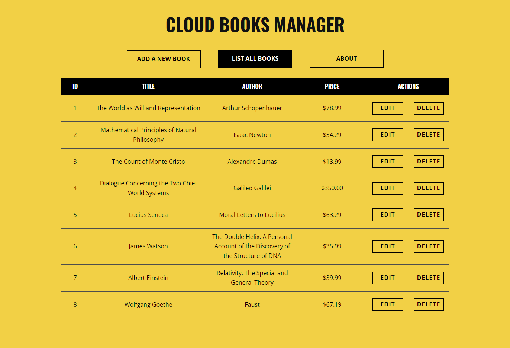
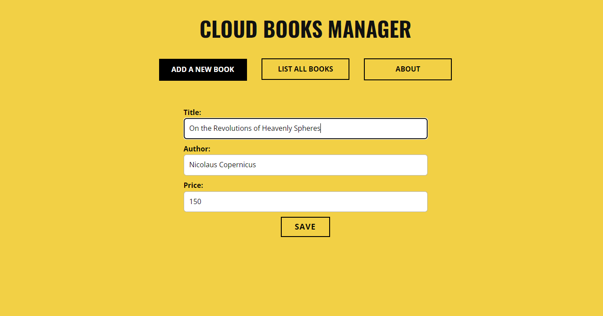
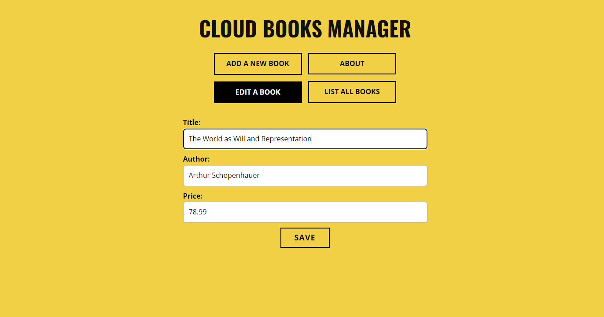

# Cloud Books Manager

## Table of Contents
1. [Basic Info](#Basic-Info)
2. [Features](#Features)
3. [Deployment](#Deployment)
4. [Database](#Database)
5. [Architecture](#Architecture)
6. [Screenshots](#Screenshots)
7. [License](#License)

## Basic Info
This program is a books manager [web-application](http://cloud-books.herokuapp.com/) which allows to browse and edit stored data. The data is stored in a cloud MySQL database.
| Parameter                               | Data                                                                                                    |
| :-------------------------------------: | :-----------------------------------------------------------------------------------------------------: |
| Program name:                           | Cloud Books Manager                                                                                     |
| Date of creation:                       | May 2022                                                                                           |
| Technologies used:                      | Java, Spring Boot,</br>MySQL, MySQL, Thymeleaf,</br>HTML, CSS, Maven  |                                                                                         |
| Author:                                 | Herman Ciechanowiec <br/> herman@ciechanowiec.eu                                                        |
| License:                                | MIT No Attribution License                                                                              |

## Features
The program has the following features:
- supported actions: list all stored books, add a new book, delete a stored book, edit a stored book
- data is stored in a remote MySQL database running in the cloud
- automatic initialization of a database table (if not exists) and polluting it with default entries
- in order to cancel possible inappropriate entries made by anonymous users, every day the program automatically resets the whole database and inputs 10 default entries
- handling of prohibited user’s actions and program errors

## Deployment
The program was deployed to Heroku platform (http://cloud-books.herokuapp.com/) as a Spring Application. Instructions regarding this way of deployment can be found here: https://devcenter.heroku.com/articles/deploying-spring-boot-apps-to-heroku.

## Database
The program uses a separate and remote MySQL database, run on the servers of [clever-cloud.com](https://www.clever-cloud.com/). For that reason, in the file `/src/main/resources/application.properties` the credentials for that database must be provided. In this repository those credentials have been removed. The syntax for the credentials should look like this:
```
spring.datasource.url=jdbc:mysql://cloud.google.com:3306/databasename?useSSL=false
spring.datasource.username=andrewbrown
spring.datasource.password=MK92#is3Pw
```

## Architecture
The program is divided into two parts: front-end (graphical user interface) and back-end (logic of the program):<br/><br/>


## Screenshots
<kbd></kbd><br/><br/>
<kbd></kbd><br/><br/>
<kbd></kbd><br/>

## License
The program is subject to MIT No Attribution License

Copyright © 2022 Herman Ciechanowiec

Permission is hereby granted, free of charge, to any person obtaining a copy of this
software and associated documentation files (the "Software"), to deal in the Software
without restriction, including without limitation the rights to use, copy, modify,
merge, publish, distribute, sublicense, and/or sell copies of the Software, and to
permit persons to whom the Software is furnished to do so.

The Software is provided "as is", without warranty of any kind, express or implied,
including but not limited to the warranties of merchantability, fitness for a
particular purpose and noninfringement. In no event shall the authors or copyright
holders be liable for any claim, damages or other liability, whether in an action
of contract, tort or otherwise, arising from, out of or in connection with the
Software or the use or other dealings in the Software.
f
